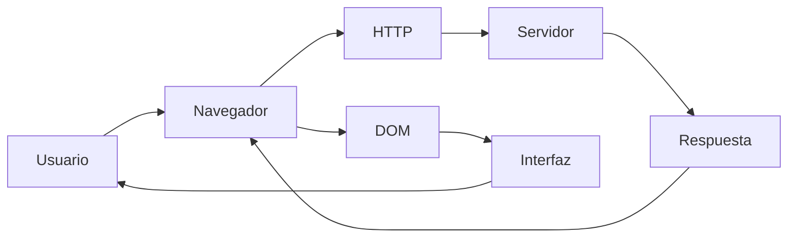
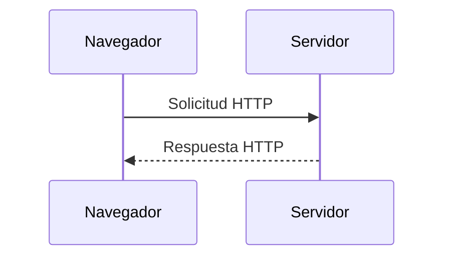
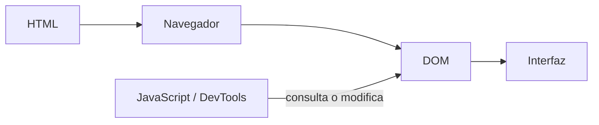
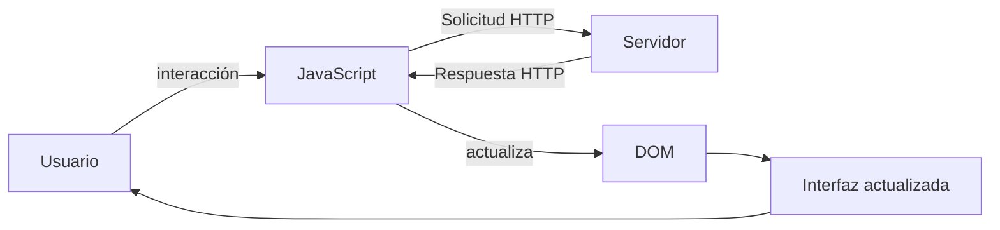
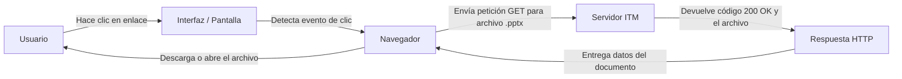

# Laboratorio 01 --- Análisis del funcionamiento de una aplicación web

> **Curso:** Aplicaciones y Servicios Web\
> **Modalidad:** Práctica de laboratorio\
> **Entrega:** Repositorio GitHub --- archivo `README.md`\
> **Evidencias:** Carpeta `evidencias/`

------------------------------------------------------------------------

## Objetivo de la práctica

Analizar el funcionamiento de una aplicación web real mediante las
herramientas de desarrollo del navegador, identificando los recursos
cargados, las solicitudes y respuestas HTTP, la estructura DOM y las
interacciones entre cliente y servidor.

## Resultado esperado

Al finalizar la práctica, el estudiante deberá poder reconstruir y
documentar el flujo observado entre:



> El diagrama anterior representa los **componentes que serán
> analizados**. El diagrama final de la práctica deberá ser construido
> por el estudiante a partir de sus propias observaciones.

------------------------------------------------------------------------

# 1. Preparación del entorno

1.  Ingrese a la aplicación web indicada por el docente.
2.  Abra las **herramientas de desarrollo** del navegador.
3.  Identifique las herramientas **Red / Network** y **Elementos /
    Elements**.
4.  Cree la siguiente estructura dentro del repositorio:

``` text
laboratorio-01/
├── README.md
└── evidencias/
```

El archivo `README.md` será el informe de la práctica. La carpeta
`evidencias/` contendrá las capturas utilizadas para sustentar los
resultados.

------------------------------------------------------------------------

# 2. Identificación de recursos de la aplicación

Abra la herramienta **Red / Network** y recargue completamente la
aplicación.

Observe las solicitudes generadas durante la carga e identifique como
mínimo **cinco recursos**, procurando seleccionar tipos diferentes:
documento HTML, CSS, JavaScript, imágenes, fuentes u otros.

## Resultados

Complete la tabla:

  Recurso           Tipo       Dominio      Tamaño
  --------- ------ --------- --------
frontendSelect    stylesheet     itm            1kB                      
logo-alcaldia        svg+xml      itm            506 kB
linkedin           svg+xml        itm            1,2 kB
ubermenu            script         itm            42,4 kB
                             
                             
                             

**Total de solicitudes observadas:** `_____`

## Evidencia

Guarde una captura de la pestaña Network como:

``` text
evidencias/network.png
```

Inclúyala aquí:

``` markdown

```

### Análisis

**¿Por qué una sola URL puede generar múltiples solicitudes HTTP?**

> Escriba aquí su respuesta.

------------------------------------------------------------------------

# 3. Análisis de una solicitud HTTP

En **Network**, seleccione una de las solicitudes realizadas por el
navegador, preferiblemente la correspondiente al documento principal.

Identifique la información solicitada a continuación.

  Elemento              Resultado
  --------------------- -----------
  URL           https://www.itm.edu.co/formatos-institucionales/
          
  Método HTTP         GET      
  Código de estado    200 OK
  
  Host / dominio      200.13.235.198:443 / itm

  Tipo de recurso     document
  Tiempo de respuesta  884 ms

## Flujo que se está observando



## Evidencia

Guarde una captura de los detalles de la solicitud como:

``` text
evidencias/request.png
```

Inclúyala en el informe:

``` markdown

```

### Análisis

**¿Qué recurso solicitó el navegador?**

> Formatos Institucionales

**¿Qué información permite determinar si la solicitud fue atendida
correctamente?**
> Código de estado 200 ok 

------------------------------------------------------------------------

# 4. Inspección del DOM

Seleccione un elemento visible de la aplicación, por ejemplo:

-   un botón;
-   un título;
-   un enlace;
-   un campo de formulario;
-   un elemento del menú.

Utilizando **Elementos / Elements**:

1.  Localice el elemento dentro del DOM.
2.  Identifique la etiqueta HTML utilizada.
3.  Modifique temporalmente su contenido desde las herramientas de
    desarrollo.
4.  Observe el cambio producido en la interfaz.
5.  Registre la evidencia.

## Resultados

**Elemento seleccionado:** `________BOTON____________________`

**Etiqueta HTML:** `_____________<a   <a/>_______________`

**Contenido original:** `_______Descargar_____________________`
X
**Modificación realizada:** `______Download______________________`

El proceso observado puede representarse conceptualmente así:



## Evidencia

Guarde la captura como:

``` text
evidencias/dom.png
```

Inclúyala aquí:

``` markdown

```

### Análisis

**¿La modificación realizada sobre el DOM alteró permanentemente la
aplicación o los archivos almacenados en el servidor? Justifique.**

> No , porque solo fue almacenado en el cachet

------------------------------------------------------------------------

# 5. Análisis de una interacción dinámica

Regrese a **Network** y limpie las solicitudes registradas.

Realice una acción dentro de la aplicación que pueda generar una
interacción con el servidor, por ejemplo:

-   consultar;
-   buscar;
-   filtrar;
-   seleccionar una opción;
-   enviar información.

Observe si aparece una nueva solicitud en Network.

## Resultados

  Elemento                       Resultado
  ------------------------------ -----------
  Acción realizada    Boton de descarga
  ¿Generó una nueva solicitud?  si
  URL solicitada      https://www.itm.edu.co/wp-content/uploads/formatos/logos2026.zip      
  Método HTTP          Get          
  Código de estado     200 OK     
  Tipo de respuesta    Formato JSON


## Ciclo de interacción

Utilice este esquema únicamente como referencia conceptual para
interpretar lo observado:



## Evidencia

Guarde la captura como:

``` text
evidencias/interaccion.png
```

Inclúyala aquí:

``` markdown

```

### Análisis

**Explique la relación entre la acción realizada por el usuario y la
solicitud observada.**

> La acción del usuario fue hacer clic en un enlace para bajar una presentación de PowerPoint (.pptx) de la página del ITM. Como respuesta, el navegador procesó con éxito la solicitud (GET 200 OK) para descargar o abrir dicho archivo.
------------------------------------------------------------------------

# 6. Reconstrucción del flujo observado

A partir de **sus propias evidencias**, construya un diagrama Mermaid
que represente el funcionamiento de la aplicación analizada.

El diagrama deberá incluir, cuando corresponda:

`Usuario` · `Navegador` · `JavaScript` · `Solicitud HTTP` · `Servidor` ·
`Respuesta HTTP` · `DOM` · `Interfaz`

> **No copie los diagramas anteriores.** Esta sección debe representar
> el flujo que usted pudo comprobar durante la práctica.

Reemplace el siguiente bloque con su diagrama:



------------------------------------------------------------------------

# 7. Observado vs. inferido

Una herramienta de desarrollo permite observar una parte del sistema,
pero no necesariamente todo lo que ocurre en el servidor.

Clasifique sus hallazgos:

## Elementos observados directamente
- Datos de la petición HTTP
- Detalles del archivo
- Tipo de contenido:
- Pestaña activa:

## Elementos inferidos
-Acción del usuario
-Procesamiento del servidor
-Software del servidor
-Uso final del archivo 

> No presente como observado un proceso interno que las herramientas del
> navegador no permitan comprobar directamente.

------------------------------------------------------------------------

# 8. Conclusiones

Redacte **tres conclusiones técnicas** derivadas de la práctica.

1 Monitoreo efectivo: La pestaña Red permite verificar en tiempo real los datos técnicos de una transferencia (como métodos, estados y direcciones IP) sin alterar la experiencia del usuario.

2 Eficiencia por caché: El estado 200 OK (de la caché del disco) demuestra cómo el navegador ahorra ancho de banda y tiempo al cargar archivos pesados desde la memoria local.

3 Rastreo de archivos: El análisis de las cabeceras HTTP expone con precisión el tipo de documento descargado (.pptx) y da pistas sobre la tecnología del servidor (/wp-content/).

------------------------------------------------------------------------

# 9. Entrega

La estructura final esperada es:

``` text
laboratorio-01/
├── README.md
└── evidencias/
    ├── network.png
    ├── request.png
    ├── dom.png
    └── interaccion.png
```

Antes de entregar, verifique:

-   [ ] El `README.md` se visualiza correctamente en GitHub.
-   [ ] Las imágenes se muestran dentro del README.
-   [ ] Se documentaron al menos cinco recursos.
-   [ ] Se analizó una solicitud HTTP.
-   [ ] Se identificó y modificó un elemento del DOM.
-   [ ] Se analizó una interacción de la aplicación.
-   [ ] El diagrama final corresponde a lo observado.
-   [ ] Se diferenciaron elementos observados e inferidos.
-   [ ] Se redactaron tres conclusiones técnicas.
-   [ ] Se realizó `commit` y `push` al repositorio.

------------------------------------------------------------------------

## Criterio de documentación

> **Las capturas son evidencia, no la respuesta.**

Cada evidencia debe estar acompañada por una explicación que indique
**qué se observó, qué significa y cómo se relaciona con el
funcionamiento de la aplicación web**.
